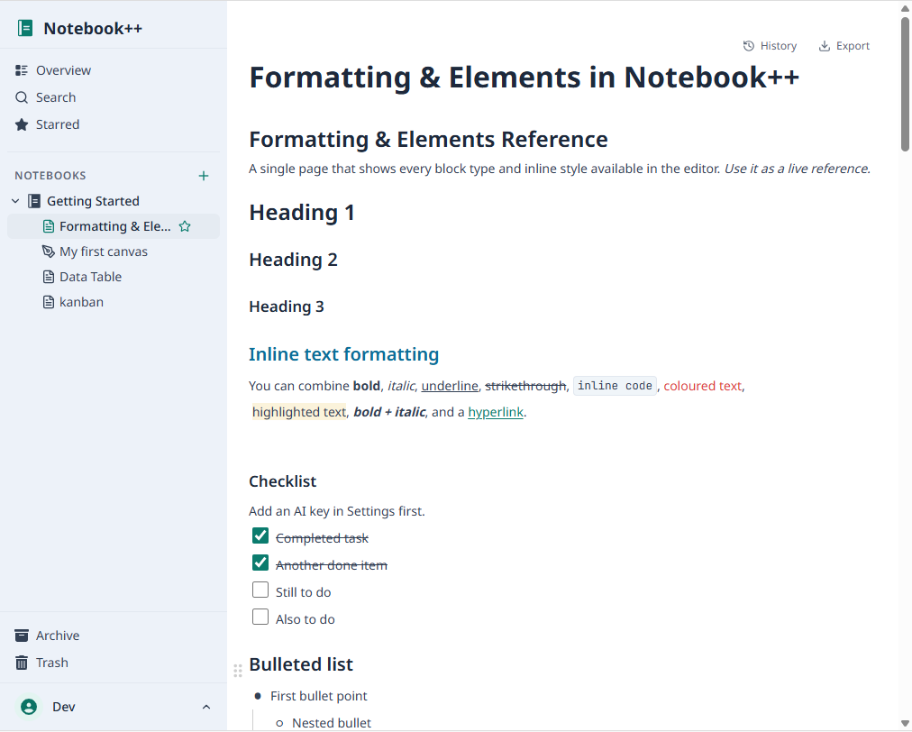
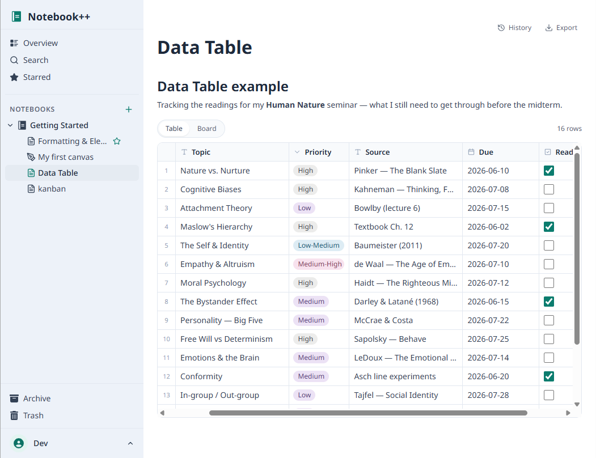
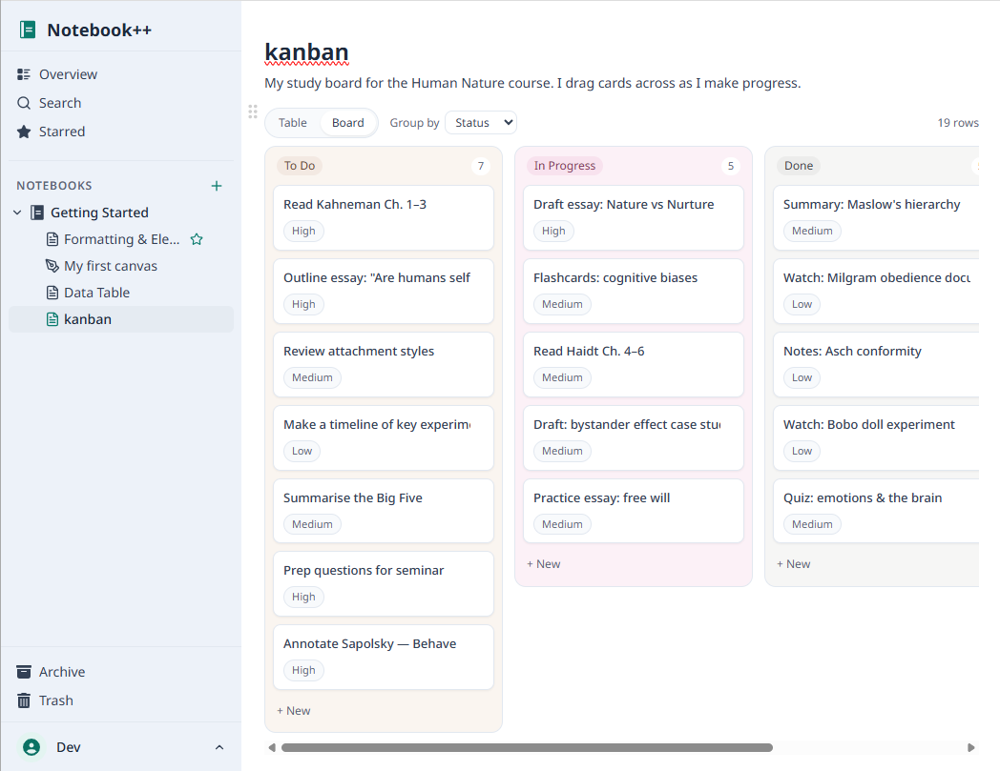
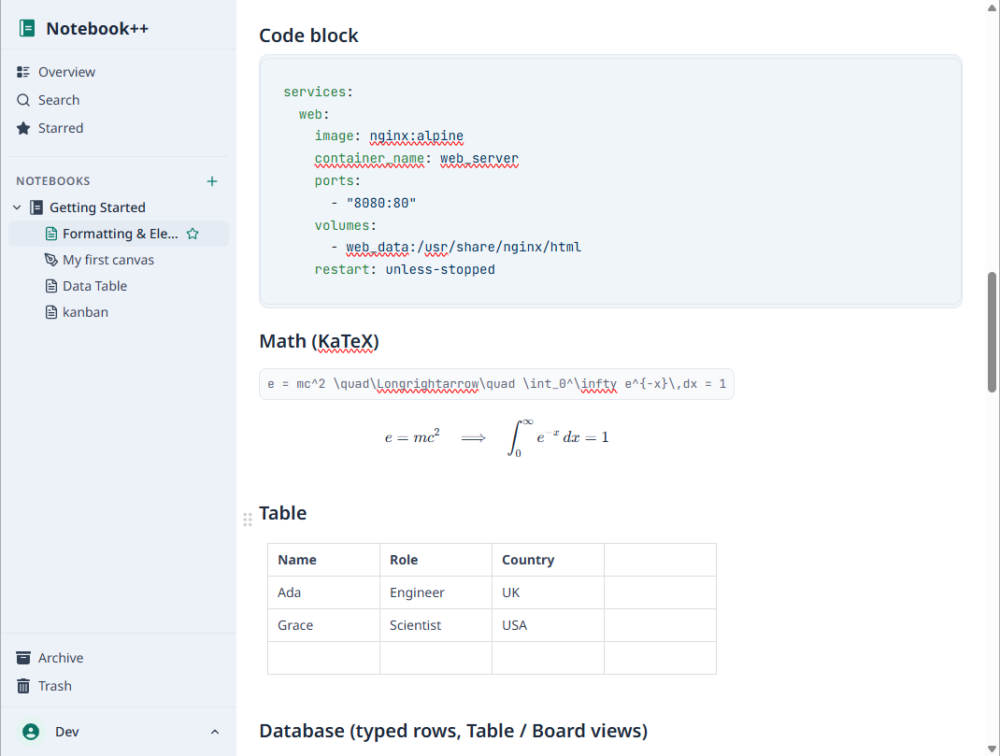
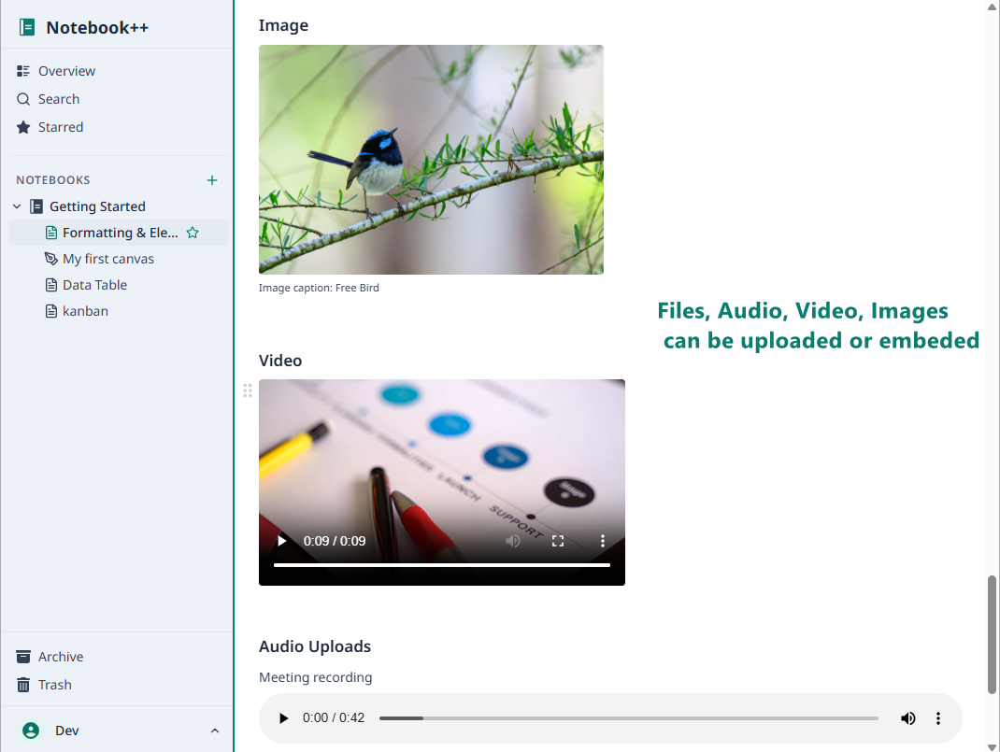

<div align="center">


# Notebook++

**A self-hosted knowledge base you actually own.**
Rich block editor, embedded databases, infinite canvases, and instant search — in one private app you run yourself.


<br />



</div>

---

**Notebook++** is a single-user, self-hosted notes & knowledge base with an Outline-style feel and none of
the team-collaboration overhead. Write in a rich block editor, drop in spreadsheet-style databases, sketch on
Excalidraw canvases, attach anything, and find it all with full-text search — on infrastructure **you** run and
control. One Docker command brings up the whole thing (app + PostgreSQL); every account starts pre-loaded with a
sample notebook, and your notes live in volumes you can back up.

## ✨ Features

- 📝 **Rich block editor** — headings, lists, checklists, callouts, quotes, tables, syntax-highlighted code, and
  math (KaTeX), with inline styles and a `/` slash menu.
- 🗄️ **Embedded databases** — typed columns (text · number · select · date · checkbox · url), switchable between a
  **Table** grid and a **Kanban board**, drag to reorder rows or move cards between lanes.
- 🎨 **Excalidraw canvases** as first-class notes — diagrams and sketches live right alongside your docs.
- 📎 **Attach anything** — images, files, audio, and video, uploaded or embedded inline.
- 🗂️ **Notebooks → notes**, with notes **nestable under other notes** (drag a note onto another to nest it).
- 🔎 **Full-text search** and a **Cmd-K** command palette.
- ↕️ **Markdown import** (files or `.zip`) and **export** (a single note or your whole workspace).
- 🤖 **Bring-your-own AI keys** (Anthropic · OpenAI · Google · Groq · OpenAI-compatible) — encrypted at rest, with
  ordered fallback across providers.
- 📱 **Installable PWA**, light/dark themes, keyboard-accessible, and per-account starter content on sign-up.
- 🔒 **Single-user & self-hosted** — no cloud, no telemetry; your data stays yours.

## 📸 A closer look

<table>
  <tr>
    <td width="50%"></td>
    <td width="50%"></td>
  </tr>
  <tr>
    <td align="center"><em>Typed database — Table view</em></td>
    <td align="center"><em>…the same data as a Kanban board</em></td>
  </tr>
  <tr>
    <td width="50%"></td>
    <td width="50%"></td>
  </tr>
  <tr>
    <td align="center"><em>Code blocks, KaTeX math & tables</em></td>
    <td align="center"><em>Images, video & audio, inline</em></td>
  </tr>
</table>

## 🚀 Quick start (Docker)

The published image and PostgreSQL run as a self-contained stack. Full walkthrough — env vars, HTTPS, backups —
in **[`installation-instructions.html`](installation-instructions.html)**.

```bash
# 1. Put docker-compose.standalone.yml in an empty folder.

# 2. Generate three secrets into a .env file beside it:
#      DB_PASSWORD       = $(openssl rand -hex 16)
#      SESSION_PASSWORD  = $(openssl rand -base64 48)   # >= 32 chars
#      ENCRYPTION_KEY    = $(openssl rand -hex 32)

# 3. Bring it up (the image is public on GHCR — no login needed):
docker compose -f docker-compose.standalone.yml up -d
```

Open <https://notes.mywebsite.com> — the first visit lands on the **registration** screen, and your account arrives
pre-loaded with the starter content. Migrations run automatically at boot.

> **Image:** `ghcr.io/uri-travoski/notebookpp` (GHCR, public) · tags `latest` and a semver per release.
> **Update:** `docker compose -f docker-compose.standalone.yml pull && … up -d`.

## 🛠 Built with

Nuxt 3 (Vue 3 + TypeScript) · Nitro · PostgreSQL 18 + Drizzle ORM · Tailwind v4 · nuxt-auth-utils (sealed-cookie
sessions) · pg-boss (jobs, no Redis) · Vite PWA. The editor is an isolated **React island** — BlockNote +
Excalidraw + TanStack Table — mounted client-only and bridged into the Vue shell.

## 🧭 How it works

Everything is Nuxt **except the editor**, which is the only React in the app: BlockNote and Excalidraw can't SSR,
so the editor is a client-only island that takes document JSON in and emits changes out — it never touches the API.
The Vue shell owns loading and debounced autosave. Two runtime services only: the app and Postgres. Database
blocks store just a `databaseId` and read/write rows through the API, so the same table can be queried outside the
document.

## 💻 Develop

Requires Node 20.19+ and Docker.

```bash
# Dev Postgres (published on 127.0.0.1:5438)
docker run -d --name notebookpp-dev-db \
  -e POSTGRES_USER=notebookpp -e POSTGRES_PASSWORD=devpassword -e POSTGRES_DB=notebookpp \
  -p 127.0.0.1:5438:5432 -v notebookpp_devdata:/var/lib/postgresql postgres:18-alpine

npm install
cp .env.example .env
npm run db:migrate
npm run db:seed                  # local dev account: dev / notebookpp
npm run dev -- --port 3939
```

Quality gate: `npm run typecheck && npm run lint && npm run build && npm test`.
